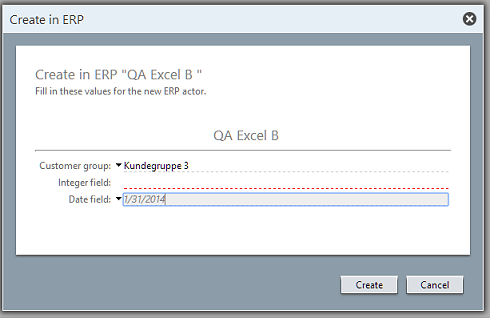

Date: 2016-05-10
SortOrder: 9

[Default value setup]()
------------------------------------

“Default value” is the chosen term for values that are sent to the ERP system when Erp Sync creates a new actor in the ERP system, but that are not actually mapped to a corresponding field in SuperOffice.

There are two ways that a field can be set up to request and/or require a default value:

-   The connection may specify that one or more fields are mandatory for a given actor type. In these cases, the field is **not** optional and needs a value before Erp Sync requests that the connection creates a new actor.
-   The user setting up the fields for use in Erp Sync may decide to set up a field as requesting and/or requiring a default value. In these cases, the user may choose between making the field mandatory or optional.

There are also different ways of generating the value that will be used for the new actor:

-   The default value can be set in the administration phase (e.g. always use the value “True” in the “credit stop”). If so, the user never sees this value when initiating the actor creation.
-   The user can select a value when initiating the actor creation
-   A combination of both; where a default value is set but the user can choose to set a different value.

Setting up a default value scheme for a given field. If the connector has marked the field as "Mandatory", the bottom checkbox will always be selected and disabled.

These settings are all stored in the SuperOffice database - they do not trigger calls to the Sync connector.

 

 

### Default Values on the Client

What happens on the client side when the user wants to create an ERP Actor from a SuperOffice contact is that the SuperOffice values are mapped to the ERP actor fields. Any additional ERP actor fields are filled in according to the defaults. If the user needs to fill in some values, these are displayed to the user in a dialog:

Once the dialog has been filled in and the user clicks OK, this triggers a call to the ERP Sync Connector's `CreateActor` method, passing in the ERP actor populated with the field values from the user and from the SuperOffice database. The connector then has to create the corresponding record in the ERP system, and record its mapping to the SuperOffice entity.

 
